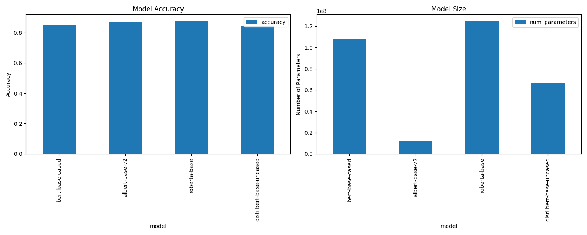

# Fine-tuning BERT-based Models for IMDB Sentiment Classification

## Table of Contents
- [Project Overview](#project-overview)
- [Data Information](#data-information)
- [Models Evaluated](#models-evaluated)
- [Benchmark Results](#benchmark-results)
- [Analysis](#analysis)
- [Conclusions](#conclusions)
- [Getting Started](#getting-started)
- [Future Work](#future-work)
- [Contributing](#contributing)
- [License](#license)

## Project Overview

This project implements a comprehensive benchmark for fine-tuning various BERT-based pre-trained models on a subset of the IMDB movie review dataset for sentiment classification. We evaluate and compare the performance of these fine-tuned models in terms of accuracy, precision, recall, F1 score, training time, and model size.

## Data Information

We use a subset of the IMDB dataset for fine-tuning and evaluation:

- **Dataset**: Subset of IMDB Movie Reviews
- **Task**: Binary Sentiment Classification (Positive/Negative)
- **Original Size**: 50,000 reviews (25,000 training, 25,000 testing)
- **Subset Size**: 2,000 reviews (1,000 for training, 1,000 for testing)
- **Source**: [IMDB Dataset](https://ai.stanford.edu/~amaas/data/sentiment/)
- **Features**: Text reviews and binary sentiment labels

## Models Evaluated

We fine-tune the following BERT-based pre-trained models:

- BERT (bert-base-cased)
- ALBERT (albert-base-v2)
- RoBERTa (roberta-base)
- DistilBERT (distilbert-base-uncased)

Each model is fine-tuned on our IMDB subset, adapting its pre-trained knowledge to the specific task of movie review sentiment classification.

## Benchmark Results

Results after fine-tuning on the IMDB subset:

| Model                  | Accuracy | Precision | Recall | F1 Score | Training Time (s) | Parameters  |
|------------------------|----------|-----------|--------|----------|-------------------|-------------|
| bert-base-cased        | 0.847    | 0.827     | 0.869  | 0.847    | 262.45            | 108,311,810 |
| albert-base-v2         | 0.869    | 0.936     | 0.785  | 0.854    | 224.26            | 11,685,122  |
| roberta-base           | 0.875    | 0.962     | 0.775  | 0.858    | 221.61            | 124,647,170 |
| distilbert-base-uncased| 0.842    | 0.915     | 0.746  | 0.822    | 113.65            | 66,955,010  |



## Analysis

1. **Accuracy**: 
   - Fine-tuned RoBERTa performs best (87.5%), followed closely by ALBERT (86.9%).
   - Fine-tuned BERT and DistilBERT show slightly lower accuracy (84.7% and 84.2% respectively).

2. **Precision and Recall**:
   - Fine-tuned RoBERTa has the highest precision (96.2%), but lower recall compared to BERT.
   - Fine-tuned BERT shows the highest recall (86.9%), indicating better performance in identifying positive samples.

3. **F1 Score**:
   - Fine-tuned RoBERTa leads with an F1 score of 0.858, closely followed by ALBERT (0.854).
   - Fine-tuned DistilBERT has the lowest F1 score (0.822), suggesting a less balanced performance.

4. **Training Time**:
   - Fine-tuning DistilBERT is significantly faster (113.65s), about half the time of other models.
   - Fine-tuning BERT takes the longest (262.45s), while RoBERTa and ALBERT have similar fine-tuning times.

5. **Model Size**:
   - ALBERT is by far the smallest model (11.7M parameters), making it efficient for deployment.
   - RoBERTa is the largest (124.6M parameters), followed closely by BERT (108.3M parameters).

6. **Efficiency vs. Performance**:
   - Fine-tuned ALBERT offers the best balance of performance and efficiency, with high accuracy and the smallest model size.
   - Fine-tuned RoBERTa provides the highest accuracy but at the cost of model size.
   - Fine-tuned DistilBERT, while less accurate, offers significant speed advantages and a smaller model size compared to BERT.

## Conclusions

After fine-tuning on the IMDB subset:

1. For highest accuracy: Choose RoBERTa
2. For best balance of performance and efficiency: ALBERT
3. For fastest inference and smallest model size: DistilBERT

The choice of model depends on the specific requirements of the application, balancing factors such as accuracy, speed, and resource constraints. These results demonstrate the effectiveness of fine-tuning pre-trained BERT-based models even on a small subset of task-specific data.

## Getting Started

### Installation

1. Clone the repository:
```bash
git clone https://github.com/MahtabRanjbar/BERT-Model-Benchmark-for-IMDB-Sentiment-Classification.git
cd BERT-Model-Benchmark-for-IMDB-Sentiment-Classification
```

2. Install dependencies:
```bash
pip install -r requirements.txt
```

### Running the Benchmark

1. Configure the fine-tuning and benchmark parameters in `config/config.yaml`

2. Run the benchmark:
```bash
python src/main.py
```
3. Results will be saved in `benchmark_results.csv` and `benchmark_results.png`.

## Future Work

- Experiment with larger variants of these models (e.g., BERT-large, RoBERTa-large)
- Increase the subset size to investigate performance on larger datasets
- Implement cross-validation for more robust results
- Explore advanced fine-tuning strategies to improve performance
- Benchmark on other sentiment analysis datasets for comparison
- Investigate the impact of different preprocessing techniques

